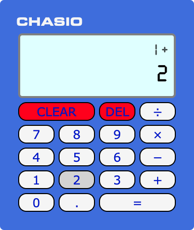
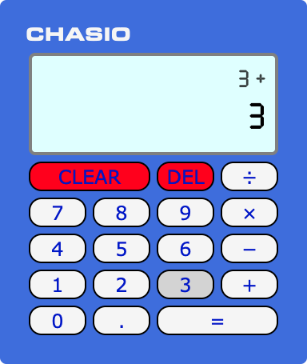
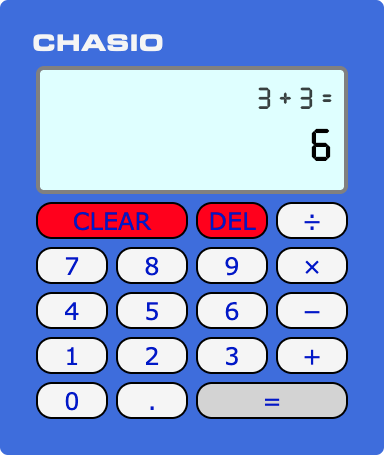
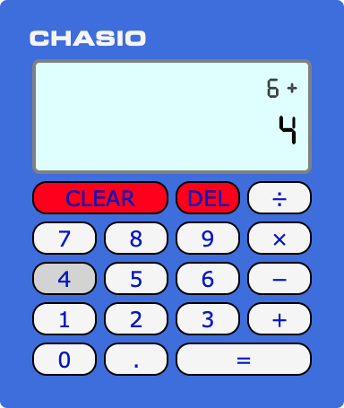

# Basic Calculator

This is a simple four-function calculator I built to practice some basic React & programming concepts.

## Features

- There are 2 lines in the display.
  - The 1st line displays the previous operand and the operation selected.
  - The 2nd line displays either the current operand being entered or the evaluated result.

E.g., `1 + 2`

- When chaining 2+ operations, the previous operand displayed updates to the evaluated result of the previous operation.

E.g., `1 + 2 + 3`

- Upon evaluation, the 1st line displays the evaluated operation.

E.g., `1 + 2 + 3 =`

- If you select an operation immediately after an evaluation, the previous result is used as an operand.

E.g., `1 + 2 + 3 =`, then `+ 4`

